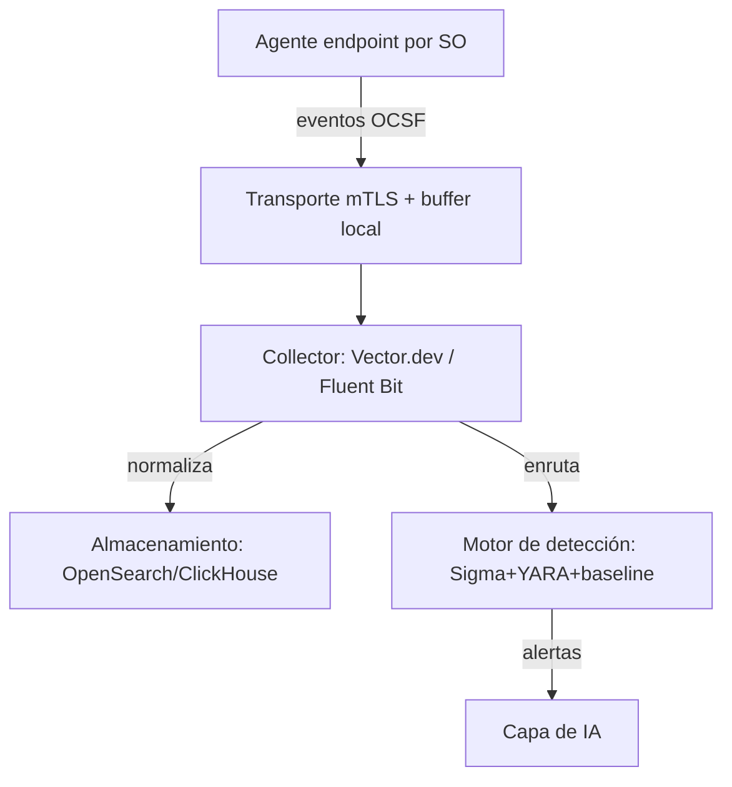
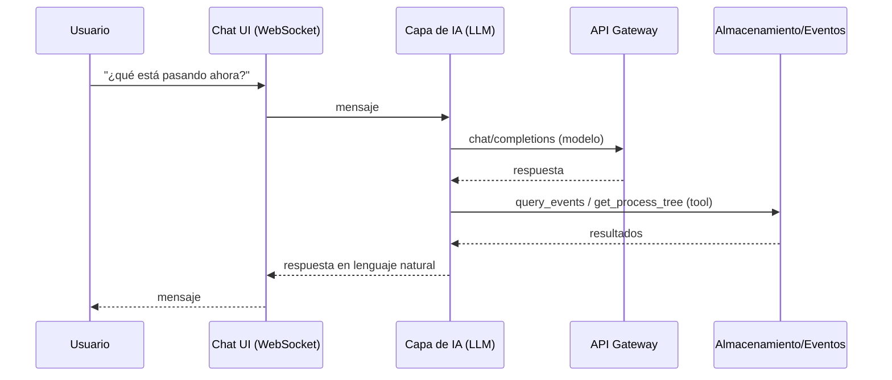
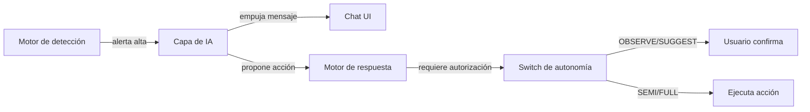

# 07 - Flujo General del Sistema

## Flujo 1 — Ingesta y detección (telemetría)

## Flujo 2 — Consulta en lenguaje natural (chat)

## Flujo 3 — Alerta de alta severidad (push proactivo)

## Flujo 4 — Ejecución de acción de remediación (switch de autonomía)

1. La IA propone una acción (ej. "aislá el host HOST-02").
2. El nivel del switch determina el comportamiento:
   - **OBSERVE:** solo lectura, no ejecuta.
   - **SUGGEST:** requiere confirmación explícita acción por acción.
   - **SEMI-AUTO:** categorías de bajo riesgo pre-autorizadas; el resto en SUGGEST.
   - **FULL-AUTO:** máxima automatización dentro de playbooks predefinidos (solo lab/testing).
3. La acción se audita (quién propuso, quién aprobó, timestamp, resultado) en log append-only con hash-chaining.

## Flujo 5 — Arranque (inferido de la arquitectura)

> **Información no especificada en la documentación original.** No se documenta secuencia de inicialización. Por el principio Fail-safe (sección 1.8), el agente inicia recolectando y buffereando localmente si el cerebro no está disponible.

## Flujo 6 — Cierre

> **Información no especificada en la documentación original.** No se documenta procedimiento de apagado.
