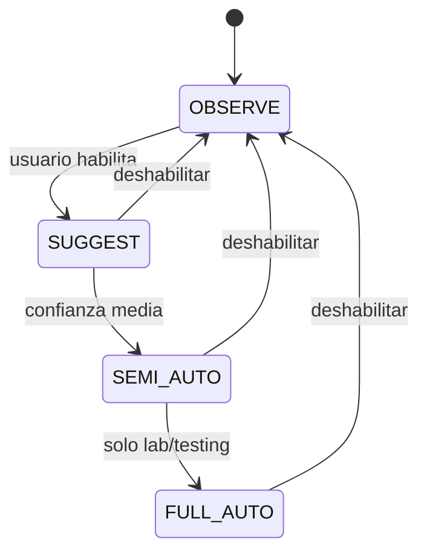

# 16 - Estados del Sistema

## 1. Inicialización

- **Agente (A):** inicia recolectando telemetría por SO. Por el principio Fail-safe (1.8), si el cerebro no está disponible, **sigue coleccionando y bufferea local** — nunca "ciego".
- **Capa de IA (F):** arranca en modo **OBSERVE-only** (Fase 3 del roadmap), sin ejecutar acciones.

> **Información no especificada en la documentación original.** No se documenta un procedimiento formal de arranque/healthcheck de los componentes A-H.

## 2. Operación

- Recolección continua → transporte → collector → almacenamiento + detección.
- Chat en tiempo real vía WebSocket.
- Detección genera alertas; IA empuja proactivamente alertas de alta severidad.
- IA propone acciones según nivel del switch.

## 3. Espera

- El agente bufferea localmente si se cae la conexión (estado de espera de reconexión).
- Nivel OBSERVE: la IA espera consultas/alertas, sin ejecutar.

## 4. Error

- **Pérdida de conexión agente↔cerebro:** Fail-safe, buffer local.
- **Fallo de proveedor LLM:** `call_with_failover` prueba el siguiente.
- **Todos los proveedores fallan:** `RuntimeError("Los tres proveedores fallaron")`.
- **Errores API:** `401`, `400`, `429`, contenido vacío (ver `13-Manejo-Errores.md`).

## 5. Recuperación

- Reenvío automático del buffer local al reconectar.
- Failover automático entre Cerebras → Groq → OpenRouter.
- Validación de IOCs contra fuentes reales ante alucinaciones.
- Auditoría inmutable preserva trazabilidad tras incidente.

## 6. Apagado

> **Información no especificada en la documentación original.** No se documenta procedimiento de apagado, graceful shutdown, ni flush del buffer.

## 7. Máquina de estados del switch de autonomía

