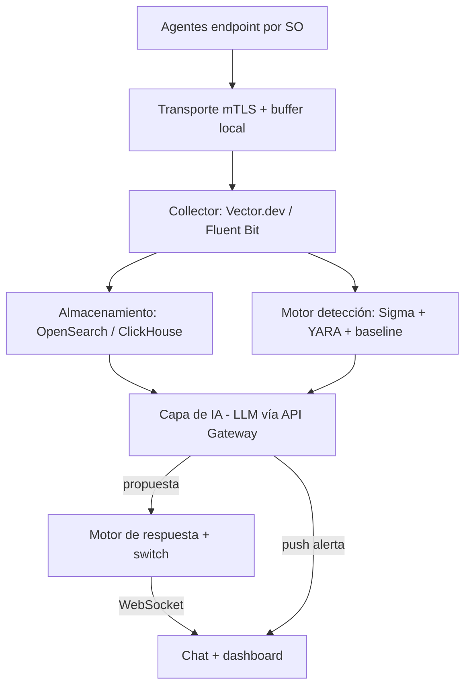
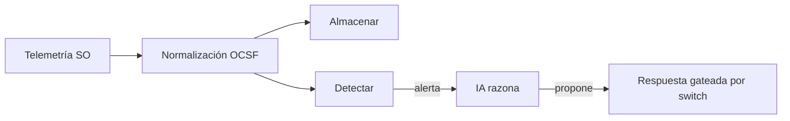
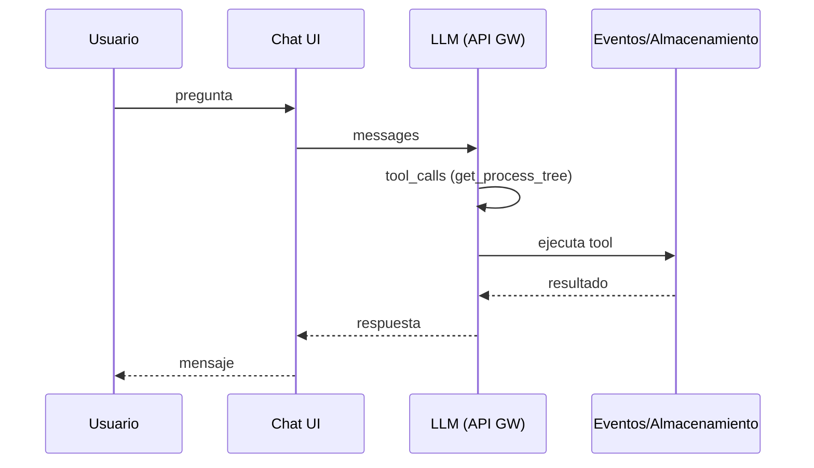
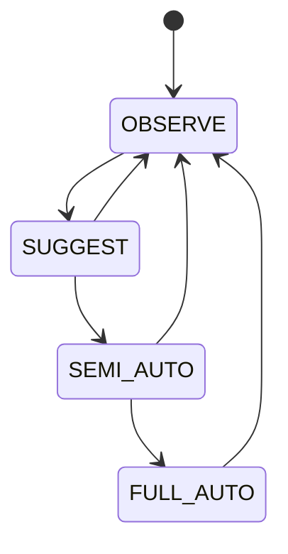
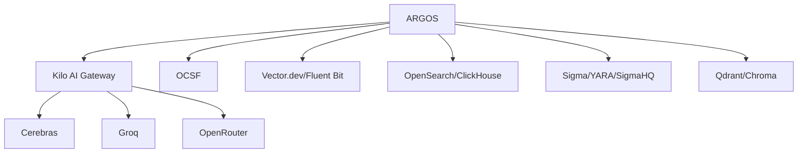
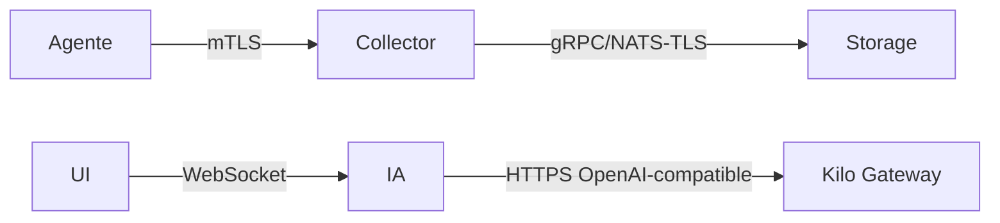
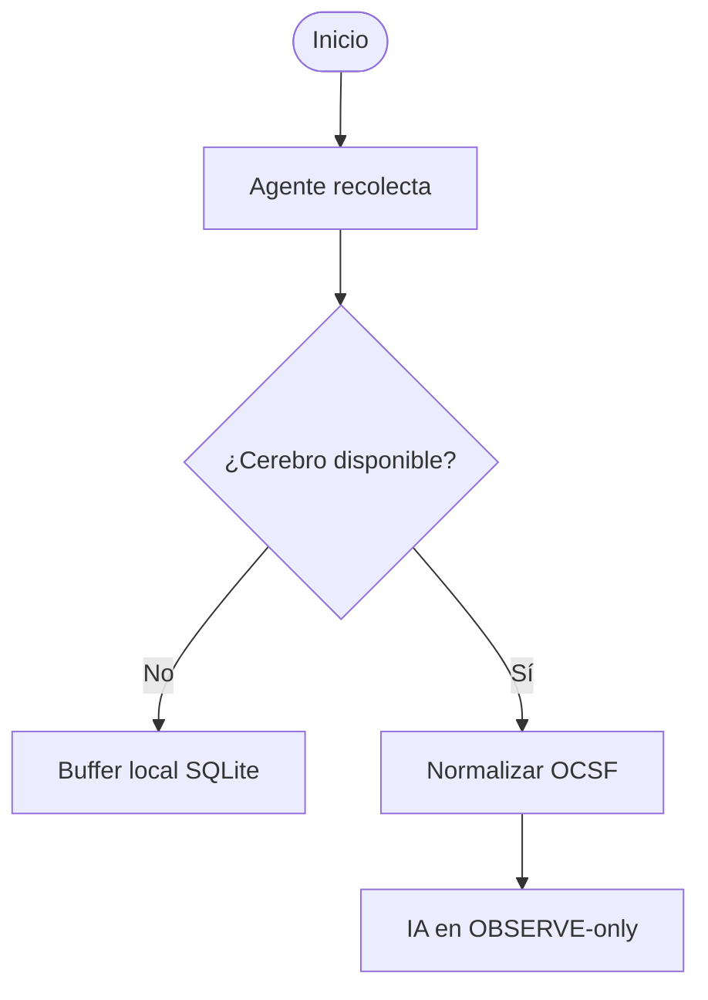
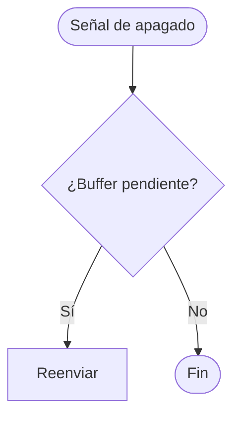
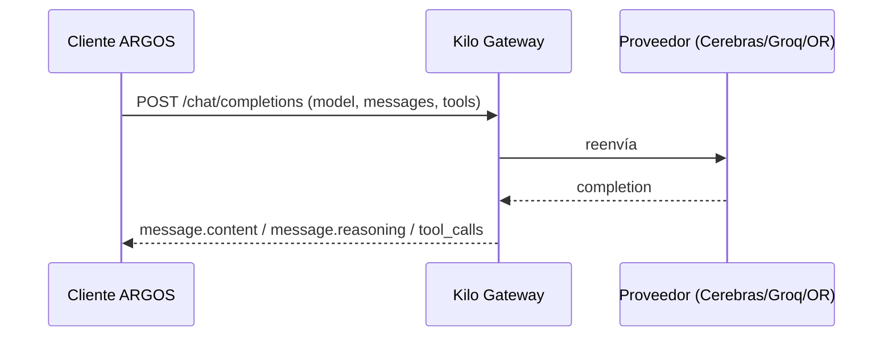
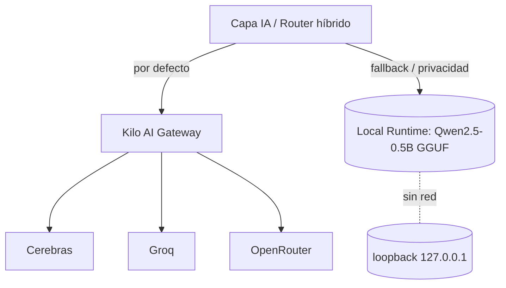

# 17 - Diagramas

## Arquitectura general

## Flujo principal

## Secuencia (chat + tool calling)

## Estados (switch de autonomía)

## Dependencias

## Comunicación

## Inicialización

## Apagado
> **Información no especificada en la documentación original.** No se documenta procedimiento de apagado. Se deja diagrama placeholder.

## Integración API

## Arquitectura híbrida (Opción C, 2026-07-11)

> Extiende la integración con un **modelo local GGUF** (Qwen2.5-0.5B-Instruct-GGUF) que corre en la máquina sin salida de red. Ver `29-Arquitectura-IA-Hibrida.md` y `30-Descarga-Modelo-Local-Qwen25.md`.

## Arquitectura híbrida (Opción C, 2026-07-11)

> Extiende la integración con un **modelo local GGUF** (Qwen2.5-0.5B-Instruct-GGUF) que corre en la máquina sin salida de red. Ver `29-Arquitectura-IA-Hibrida.md` y `30-Descarga-Modelo-Local-Qwen25.md`.

