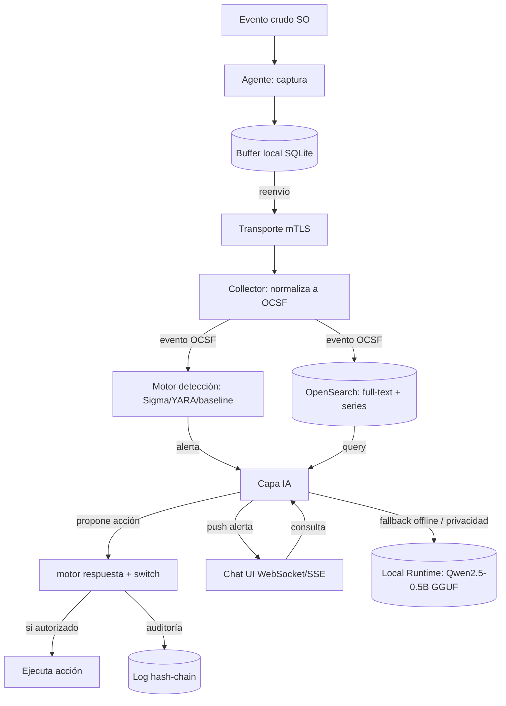
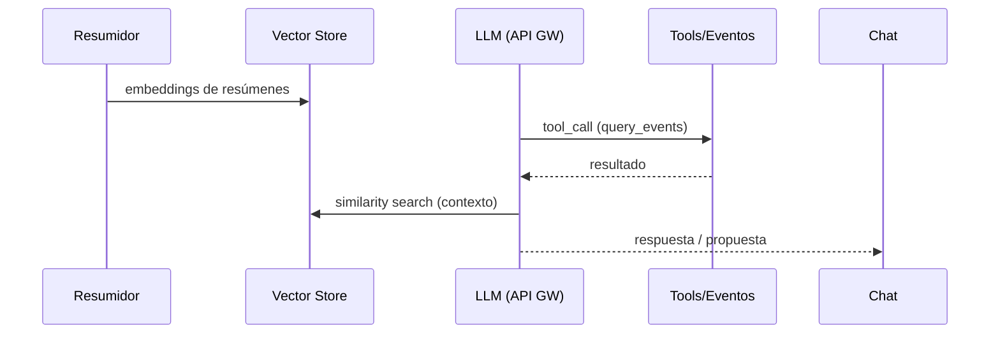

# 27 - Flujos de Datos y Contratos

## 1. Cadena de flujo de datos (de arriba a abajo)

> **Modo híbrido (Opción C, 2026-07-11).** La Capa IA (F) puede resolver inferencia localmente cuando la API Gateway no está disponible o por política de privacidad. El runtime local no sale a la red. Ver `29-Arquitectura-IA-Hibrida.md`.

## 2. Contratos entre módulos

### 2.1 Agente → Collector (transporte)
- **Canal:** mTLS (gRPC directo o NATS/MQTT sobre TLS).
- **Formato de salida del agente:** evento en esquema común **OCSF**.
- **Modo degradado:** si cae conexión, el agente escribe en buffer local (SQLite) y reenvía al reconectar.

### 2.2 Collector → Almacenamiento / Detección
- El collector recibe eventos crudos por SO y los **normaliza a OCSF**, luego enruta:
  - a **Almacenamiento** (OpenSearch/ClickHouse) para full-text y series temporales.
  - a **Motor de detección** para evaluación de reglas.

### 2.3 Motor de detección → Capa IA
- Produce **alertas** (con severidad) que disparan push proactivo al chat y/o propuesta de acción.

### 2.4 Capa IA → Almacenamiento (tools)
- La IA lee vía 6 tools (no logs crudos): `query_events`, `get_process_tree`, `get_active_connections`, `list_alerts`, `lookup_ioc`, `explain_attck_technique`.
- Antes: un resumidor/indexador convierte eventos crudos en resúmenes + embeddings en vector store (Qdrant/Chroma).

### 2.5 Capa IA → Motor de respuesta
- La IA **propone** acción; el motor de respuesta la ejecuta solo si el switch de autonomía lo autoriza.
- Toda acción se escribe en **log de auditoría append-only con hash-chaining**.

### 2.6 Chat UI ↔ Capa IA
- WebSocket bidireccional; sesión de contexto por host/incidente; eventos nuevos empujados vía el mismo canal o SSE.

## 3. Esquema de evento OCSF (propuesto a partir de la taxonomía sección 4)

> **Nota:** la documentación base NO define campos exactos del DTO OCSF. El siguiente esquema mínimo se **deriva** de la taxonomía de eventos (sección 4) y los Event IDs de Sysmon/ETW documentados. Debe validarse/ampliarse en implementación.

| Campo | Origen documentado | Descripción |
|---|---|---|
| `class_uid` / `category` | Sección 4 (10 categorías) | Ejecución, Red, Filesystem, Persistencia, Identidad, Kernel, Memoria, LotL, USB, Exfiltración |
| `time` | implícito | Timestamp del evento |
| `host` | implícito | Hostname/dispositivo |
| `process.pid` / `process.parent_pid` | Sysmon 1 | Árbol de proceso |
| `process.cmdline` | Sysmon 1 (línea completa) | Línea de comandos |
| `process.image` / `process.hash` | Sysmon 1 | Binario y hash |
| `network.src_ip` / `dst_ip` / `port` / `dns` | Sysmon 3/22; sección 4 | Conexiones y DNS |
| `file.path` / `file.action` | Sysmon 11 | Creación/borrado |
| `registry.key` / `action` | Sysmon 12/13/14 | Persistencia |
| `identity.user` / `logon.result` | Event Log 4624/4625 | Auth |
| `technique.attack_id` | Sección 4 (TAxxxx) | Mapeo ATT&CK |
| `severity` | alerts | Severidad de la regla |

## 4. Flujo de datos de la IA (consumo externo vía API Gateway)

## 5. Flujo de datos de auditoría

Cada acción genera un registro: `{quién_propuso, quién_aprobó, timestamp, resultado, hash_previo, hash_actual}`. El `hash_actual` incluye el `hash_previo` → cadena inmutable (Merkle-style).

> **Información no especificada en la documentación original.** No se especifican: formato de serialización del evento en transporte (JSON/Protobuf), tamaño máximo de mensaje, schema registry, ni contrato exacto de la API interna entre collector y motor de detección.
