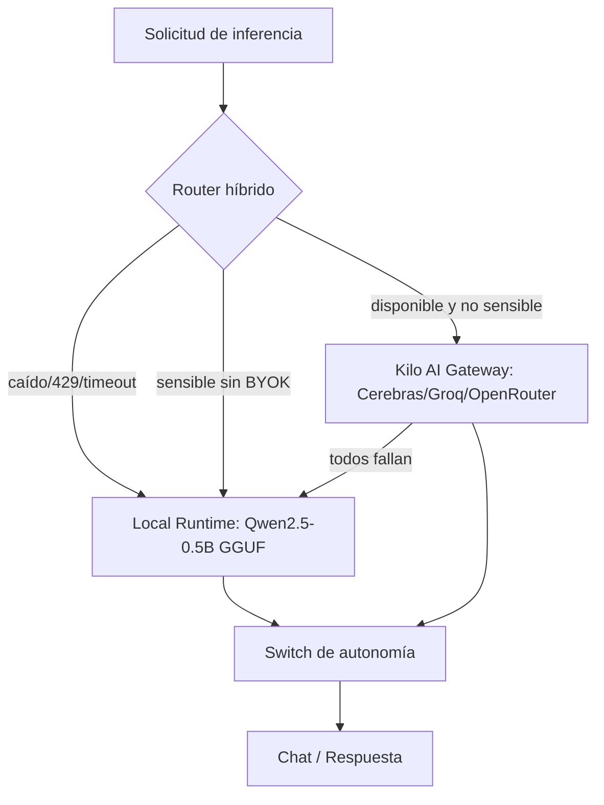
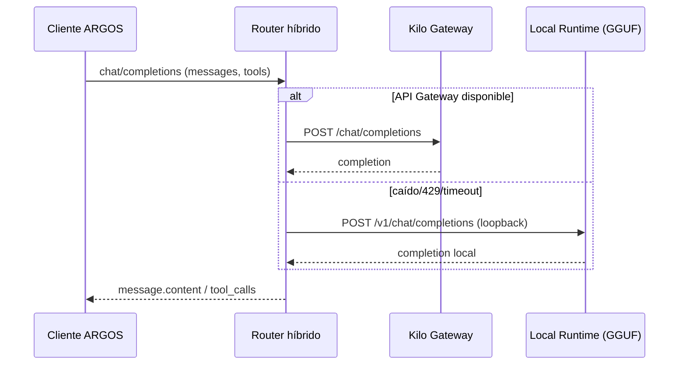

# 29 - Arquitectura de IA Híbrida (API Gateway + Modelo Local)

> **Banner de decisión (Opción C — Híbrida).** El documento maestro de arquitectura establece que *"la IA se consume únicamente mediante la API Gateway"* y `AGENTS.md` fija que *"la única comunicación externa permitida será mediante la API Gateway"*. Con fecha **2026-07-11** el usuario eligió explícitamente la **Opción C (Híbrida)**: mantener la API Gateway como núcleo de razonamiento remoto y añadir un **modelo local GGUF** (Qwen2.5-0.5B-Instruct-GGUF, según `Docs/IA_Local_Descargar.md`) ejecutado en la propia máquina.
>
> Por tanto, este documento es una **extensión decidida por el usuario** del alcance base. No sustituye la API Gateway; la conserva y la complementa. Todo lo que no provenga del documento base se marca como **decisión de implementación híbrida** y no como requisito original.

## 1. Principios de la arquitectura híbrida

1. **Software 100% local:** toda la lógica (agentes, collector, almacenamiento, detección, respuesta, chat) corre en la máquina/s del operador.
2. **Única salida de red hacia terceros = API Gateway** (Kilo AI Gateway, `https://api.kilo.ai/api/gateway`). El modelo local **no** realiza ninguna llamada de red.
3. **API Gateway = cerebro de razonamiento principal.** Modelos remotos grandes (Cerebras/Groq/OpenRouter, 70B–120B+) para análisis profundo, correlación, herramientas y razonamiento.
4. **Modelo local = complemento.** Qwen2.5-0.5B-Instruct-GGUF (0.5B parámetros) para fallback offline, pre-screening/privacidad y tareas de baja latencia que no requieren razonamiento profundo.

## 2. Por qué híbrido (asignación de roles)

| Rol | Canal | Modelo(s) | Cuándo |
|---|---|---|---|
| Razonamiento profundo / cerebro SOC | API Gateway (remoto) | Cerebras (llama-4-scout), Groq (llama-3.3-70b), OpenRouter (failover) | Por defecto; análisis complejo, tool calling, correlación |
| Fallback offline / air-gapped | Modelo local (GGUF) | Qwen2.5-0.5B-Instruct-GGUF | API Gateway caída, `429` (200 req/h IP agotadas), timeout 30s agotado, o sin red |
| Guard de privacidad / pre-screening | Modelo local (GGUF) | Qwen2.5-0.5B-Instruct-GGUF | Datos sensibles sin BYOK; se ofusca/localiza antes de enviar al cloud |
| Triage / clasificación de alto volumen | Modelo local (GGUF) | Qwen2.5-0.5B-Instruct-GGUF | Descarga de trabajo del canal remoto en tareas triviales |

> **Nota de honestad sobre el tamaño.** Qwen2.5-0.5B tiene 0.5B parámetros y contexto 8192 tokens (según el card del repo en HuggingFace, consultado 2026-07-11). **No es un sustituto del cerebro SOC**: su capacidad de razonamiento es limitada. Los roles anteriores son coherentes con ese tamaño (no se le delegan decisiones críticas autónomas).

## 3. Componente F extendido (Capa de IA híbrida)

El módulo `ai-layer/` (doc `28-Especificacion-Diseno-Modulos.md`, Módulo F) se amplía con un **runtime local**:

| ID | Subcomponente | Responsabilidad |
|---|---|---|
| F1 | Resumidor/indexador | Convierte eventos crudos en resúmenes + embeddings → vector store (sin cambio vs doc base) |
| F2 | **Local Runtime** | Carga el GGUF con un runtime local (llama.cpp / llama-cpp-python / Ollama) y expone un servidor **OpenAI-compatible** en `http://127.0.0.1:<puerto>/v1` |
| F3 | **Router híbrido** | Decide enrutar cada petición a API Gateway o a Local Runtime según política (disponibilidad, privacidad, criticidad, tamaño de contexto) |
| F4 | Tools / prompts / validador / guard | Sin cambio vs doc base (6 tools, system prompt, validador de `tool_calls`, guard de privacidad) |

## 4. Política de enrutamiento (híbrida)

1. **Por defecto → API Gateway** (cerebro principal).
2. **Si API Gateway no responde** (excepción de red, `401` con key mal, `429`, timeout de 30s agotado) → **Local Runtime** en modo degradado.
3. **Si datos sensibles y no hay BYOK** → pre-screening en **Local Runtime**; ofuscar/hashear antes de enviar al cloud (coherente con `12-Seguridad.md` §6).
4. **Switch de autonomía aplica a ambos canales** por igual (OBSERVE/SUGGEST/SEMI-AUTO/FULL-AUTO).
5. **Failover de 3 proveedores remotos** (Cerebras→Groq→OpenRouter) se mantiene dentro del canal API Gateway; solo si los tres fallan se cae a Local Runtime.

## 5. Contratos del Local Runtime

- Expone endpoint **OpenAI-compatible**: `GET /v1/models` y `POST /v1/chat/completions`.
- Reutiliza el **mismo SDK OpenAI** que el API Gateway; solo cambia `base_url` (`http://127.0.0.1:<puerto>/v1`) y se omite `Authorization`.
- Mismos esquemas de `messages`, `tools`, `tool_calls`, `response_format` que el doc `08-API-Gateway.md` y `09-Integracion-IA.md`.
- Parámetros soportados dependen del runtime local (context_length 8192 según card del modelo).

## 6. Privacidad y seguridad (extensión)

- El modelo local **no entrena con prompts** (corre en la máquina, sin red). Útil para datos confidenciales.
- Sigue aplicando el **guard de privacidad** al enviar a API Gateway (todos los `:free` entrenan con prompts, Doc 4).
- El runtime local debe escuchar **solo en loopback** (`127.0.0.1`); no exponer el puerto local a la red.
- El GGUF es un binario grande; ver `30-Descarga-Modelo-Local-Qwen25.md` §9 (no commitear salvo intención, añadir a `.gitignore`).

## 7. Estados de la integración (extiende `09-Integracion-IA.md` §7)

| Estado | Descripción |
|---|---|
| Híbrido activo | Ambos canales disponibles; API Gateway por defecto |
| Fallback Local activo | API Gateway caído/limitado → inferencia local degradada |
| Solo Local (air-gapped) | Sin red; todo se resuelve localmente (capacidades reducidas) |
| Failover remoto activo | Un proveedor cae → siguiente (Cerebras→Groq→OpenRouter) |
| Todos fallan (remoto) | `RuntimeError("Los tres proveedores fallaron")` → degrada a Local Runtime |

## 8. Diagrama de secuencia híbrido

## 9. Requisitos de hardware (inferibles)

- CPU moderna x86-64/ARM64; RAM suficiente para cargar el modelo (q4_k_m ≈ 400–500 MB + overhead del runtime).
- GPU opcional (CUDA/Metal/Vulkan) para acelerar; si no, inferencia por CPU (más lenta, aceptable para 0.5B).
- Disco: espacio para el GGUF (q4_k_m ≈ 400–500 MB; fp16 ≈ 1.18 GiB; ver `30-Descarga-Modelo-Local-Qwen25.md`).

## 10. Información no especificada / decisión de implementación

- **Decisión de implementación híbrida (no en doc base):** la adición del modelo local y el runtime (llama.cpp / llama-cpp-python / Ollama) son consecuencia de la Opción C del usuario; no figuran en el documento maestro ni en `AGENTS.md` como arquitectura original.
- **Información no especificada en la documentación original:** no se fija qué runtime local usar (llama.cpp vs Ollama vs LM Studio), puerto del servidor local, política exacta de umbrales de fallover local, ni si el modelo local 0.5B soporta `tool_calls` con igual fidelidad que los remotos (verificar en implementación).
